# BIT - Bezpečnosť informačných technológií

### Semestrálny projekt

## E-mail spoofing pomocou nesprávnej konfigurácie SPF/DKIM/DMARC záznamov

##### Autor: Marek Čederle

<!-- ### Špecifikácia (Čo analyzujem)

V projekte sa zameriam na dopad nesprávnej konfigurácie resp. jej absencie pre mechanizmy SPF, DKIM a DMARC na autentizáciu  e-mailov a ich zneužitie na spoofing. V teoretickej časti sa budem venovať vysvetleniu týchto mechanizmov a ich vzájomnému prepojeniu. Dané mechanizmy obsahujú možnosť hlásenia pokusov o spoofing, ktorú by som chcel taktiež preskúmať. Taktiež sa budem venovať analýze e-mailových hlavičiek, konkrétne identifikáciou útočníkov, ktorí sa snažia o spoofing.

### Ciele (Aké budu výstupy)

- Vytvoriť phishing mail, ktorý sa bude snažiť spoofovať určitú doménu
- Ukázať správanie rôznych konfigurácií SPF/DKIM/DMARC záznamov, keď sa budem pokúšať o spoofing (žiadna, nekorektná, korektná/optimálna konfigurácia)
- Ukázať si ako funguje reportovanie pokusov o spoofing, kedy príde ku odmietnutiu e-mailu a kedy e-mail bude doručený
- Vytvoriť skript, ktorý bude analyzovať hlavičku týchto e-mailov a bude sa snažiť identifikovať útočníka
- Výstup budú odporúčania pre správne nastavenie SPF/DKIM/DMARC záznamov -->

<!-- INFO: -->

<!--
- Analýza problémovej oblasti a existujúcich riešení
- Návrh riešenia problému, architektúra, porovnanie útokov, metóda testovania, etc.
- Opis funkcií a použitia prototypu
- Požiadavky na dokument
  - obrázky, tabuľky, grafy a štruktúrovaný text
  - rozumný * počet strán vlastného povodu, žiadna vata prosím
-->

### Analýza problémovej oblasti a existujúcich riešení

E-mail spoofing je forma falšovania identity, ktorá sa používa primárne pre phishingové kampaňe. Ide o techniku, pri ktorej útočník použije hlavičku e-mailu na zamaskovanie svojej identity a vydáva sa za legitímneho odosielateľa. Väčšinou ide o nejaký dôležitý subjekt ako banka alebo iné veľké známe spoločnosti.

Keďže e-mailové protokoly, ktoré sa používajú ako napr. SMTP sú veľmi staré a neboli vytvárané s ohľadom na bezpečnosť v budúcnosti, od začiatku neposkytovali žiadne mechanizmy na overenie identity odosielateľa. Bolo priam triviálne pre útočníkov zneužívať túto zraniteľnosť. Preto sa v priebehu rokov vyvinuli rôzne mechanizmy na overenie identity odosielateľa, medzi ktoré patria napríklad SPF, DKIM a DMARC.

#### Sender Policy Framework (SPF)

Ide o DNS TXT záznam, ktorý špecifikuje, ktoré mail servery sú oprávnené posielať e-maily za danú doménu.

Príklad SPF záznamu:
```
v=spf1 ip4:192.168.1.1 include:_spf.google.com ~all
```
- `v=spf1` - verzia SPF
- `ip4:` - povolená IP adresa
- `include:` - zahrnutie SPF záznamu inej domény, čiže IP adresa v SPF zázname danej domény je tiež povolená
- `all` - záverečné pravidlo, ktoré určuje, ako sa má zaobchádzať s e-mailmi, ktoré nespĺňajú predchádzajúce pravidlá (existuje viacero pravidiel než len `all`)

Modifikátory:
```
- (Fail) - zakázané
~ (SoftFail) - zakázané, ale email sa prijme (vačšinou potom obsahuje tag ako Spam/Insecure)
? (Neutral) - interpretované ako NONE (čiže žiadna nastavená politika)
+ (Pass) - povolené
```

##### Obmedzenia SPF

Po implementovaní SPF sa zistilo, že samotný SPF mechanizmus nestačí na úplnú ochranu proti spoofingu. Mechanizmus bráni falšovaniu adresy `envelope-from`, útočníkom však stačí iba sfalšovať adresu v poli `From` v hlavičke e-mailu, ktorú vidí príjemca keď si otvorí mail.

#### DomainKeys Identified Mail (DKIM)

DKIM je kryptografický mechanizmus, ktorý pridáva digitálny podpis do e-mailovej hlavičky. Príjemca môže overiť, že obsah správy a niektoré hlavičky neboli modifikované a pochádzajú z autorizovaného servera.

DKIM má dva hlavné prvky:
- DKIM TXT záznam uložený v DNS pre danú doménu
- DKIM hlavičku, ktorá sa pridáva ku každému odoslanému e-mailu z tejto domény

Princíp:
- Odosielateľ pridá DKIM podpis do hlavičky emailu
- Verejný klúč je publikovaný v DNS (TXT záznam)
- Príjemca overí podpis pomocou verejného kľúča, čím sa zabezpečí integrita správy a autentickosť odosielateľa

Príklad DKIM záznamu:
```bash
dig TXT cf2024-1._domainkey.email.cloudflare.net +short
# output:
"v=DKIM1; h=sha256; k=rsa; p=MIIBIjANBgkqhkiG9w0BAQEFAAOCAQ8AMIIBCgKCAQEAiweykoi+o48IOGuP7GR3X0MOExCUDY/BCRHoWBnh3rChl7WhdyCxW3jgq1daEjPPqoi7sJvdg5hEQVsgVRQP4DcnQDVjGMbASQtrY4WmB1VebF+RPJB2ECPsEDTpeiI5ZyUAwJaVX7r6bznU67g7LvFq35yIo4sdlmtZGV+i0H4cpYH9+3JJ78k" "m4KXwaf9xUJCWF6nxeD+qG6Fyruw1Qlbds2r85U9dkNDVAS3gioCvELryh1TxKGiVTkg4wqHTyHfWsp7KD3WQHYJn0RyfJJu6YEmL77zonn7p2SRMvTMP3ZEXibnC9gz3nnhR6wcYL8Q7zXypKTMD58bTixDSJwIDAQAB"
```
- `v` - verzia DKIM
- `h` - hashovací algoritmus
- `k` - typ kľúča
- `p` - verejný kľúč zakódovaný v base64

_Existuje viacero častí DKIM záznamu, ktoré určujú správanie DKIM mechanizmu ale vyššie spomenuté sú tie najdôležitejšie._

Ako je vidieť vyššie, nejde o klasický TXT záznam. Sa skladá z viacerých častí:
`selector._domainkey.domain.tld`

Selector je názov, ktorý určuje konkrétny DKIM kľúč. Môže byť akýkoľvek a nastavuje ho poskytovateľ e-mailových služieb.

DKIM v hlavičke emailu sa štrukturálne veľmi podobá záznamu, ale obsahuje aj samotný podpis `b=`, ktorý je generovaný z hlavičiek definovaných v `h=` časti a hashu tela emailu `bh=`.

Ani DKIM však nie je úplne dokonalí a obsahuje nejaké vektory útokov. Napríklad pri použití krátkych klúčov na podpisovanie môžu byť tieto klúče prelomené do pár hodín alebo dní.

#### Domain-based Message Authentication, Reporting and Conformance (DMARC)

Nadstavba nad SPF a DKIM, ktorá definuje politiku pre neautentifikované správy a umožňuje ich nahlasovanie. DMARC politika hovorí o tom, čo sa má stať s emailom po skontrolvaní mechanizmami SPF a DKIM.

Príklad DMARC záznamu:
```
v=DMARC1;  p=reject; rua=mailto:example@dmarc-reports.cloudflare.net
```

Politiky:

- `p=` = politika
  - `none` - iba monitoring (bez akcie)
  - `quarantine` - presun do karantény/spam
  - `reject` - odmietnutie správy
- `rua=` = adresa pre zasielanie agregovaných reportov o neautentifikovaných správach

_Existuje viacero častí DMARC záznamu, ktoré určujú správanie DMARC mechanizmu ale vyššie spomenuté sú tie najzákladnejšie._

DMARC je vhodný použiť aj pre domény, ktoré neodosielajú žiadne e-maily, pretože pri správnom nastavení SPF a DKIM to zabráni útočníkom v zneužití týchto domén na spoofing, pretože všetky emaily z týchto domén budú odmietnuté.

### Existujúce riešenia

Riešení na túto problematiku existuje naozaj veľa. Analyzoval som iba niektoré z nich.

| Nástroj | Účel |
|---------|------|
| PyPhisher | Phishing framework |
| checkdmarc | Overenie DNS záznamov |
| swaks | SMTP testovanie |
| dmarc | skript na parsovanie DMARC zaznamov |
| ghostmail-collector | Zoznam jednorazových/dočasných domén |

- PyPhiser je komplexný nástroj pre phishingové kampaňe. Dokáže vytvoriť phishing stránky pre najviac populárne webstránky a vie odchytiť IP adresy a prihlasovacie údaje.
- checkdmarc je nástroj na overenie správnosti nastavenia SPF/DKIM/DMARC záznamov pre danú doménu.
- swaks je nástroj na testovanie SMTP serverov. Umožňuje odosielať e-maily s vlastnými hlavičkami, čo je užitočné pre testovanie avšak dá sa zneužiť na spoofing.
- dmarc je jednoduchý skript na parsovanie DMARC záznamov.
- ghostmail-collector je projekt, ktorý zhromažďuje zoznam jednorazových a dočasných domén, ktoré sa dajú zneužiť na spoofing.

Vyskúšal som si všetky nástroje a zistil som, že pre môj projekt bude najvhodnejšie použiť kombináciu niektorých z nich.

### Riešenie

#### Návrh riešenia problému

Napriek tomu, že existujú takéto mechanizmy, stále existujú domény, ktoré nemajú správne nakonfigurované tieto záznamy, alebo ich nemajú nakonfigurované vôbec. To umožňuje útočníkom zneužívať tieto domény na spoofingové útoky.

Trochu som zmenil pôvodný cieľ resp. výstup projektu a miesto skriptu na analýzu hlavičiek som sa rozhodol vytvoriť nástroj, ktorý nájde spoofovateľnú doménu a následne odošle spoofovaný e-mail na zadanú cieľovú adresu.

Stručný workflow riešenia je nasledovný:
1. Nástroj získa zoznam jednorazových/dočasných domén z ghostmail-collector repozitára.
2. Pre každú doménu overí nastavenie SPF/DKIM/DMARC záznamov pomocou dmarc nástroja.
3. Ak nájde doménu bez správneho nastavenia týchto záznamov, tak ju ponúkne používateľovi na výber.
4. Použije `swaks` na odoslanie spoofovaného e-mailu na zadanú cieľovú adresu.

#### Implementácia

Nástroj som implementoval v Pythone. Využil som niektoré zo spomenutých github projektov, pričom  nástroj z `dmarc` repozitára som mierne upravil, aby okrem DMARC záznamu vedel získať aj SPF a DKIM záznamy. Pracoval som vo WSL na Kali Linuxe. Nástroj používa programy dostupné v systéme, ako `dig` na získanie DNS záznamov a `swaks` na odoslanie e-mailu. V prípade že chýbajú tak program vyzve používateľa aby si nástroje nainštaloval.

Testoval som spoofovanie domén s a bez ochranných mechanizmov. Testoval som posielanie emailov na nasledujpce služby:
- Gmail
- STUBA email
- Cloudflare email forwarding
- Proton.me

Inštrukcie na použitie a nastavenie nástroja sú priamo v [github repozitári projektu](https://github.com/MeheheCedy22/BIT).

Program má 3 režimy:
- `check` - iba overí dependencies
- `send` - ak špecifikované aspoň minimálne potrebné parametre, tak odošle predvolený spoofovaný email
- `interactive` - hlavný interaktívny režim, kde používateľ zadáva všetky potrebné parametre počas behu programu, spúšta sa celá workflow opísaná vyššie

Použitie:
```bash
python3 email_tool.py interactive
# pre zobrazenie nápovedy
python3 email_tool.py --help
```

#### Testovanie

_Poznámka: Ako aj bude z testovania jasné, tak okrem služby Proton, ostatné email služby, ktoré som skúšal, mi ani nedovolili poslanie spoofovaného emailu kvôli iným ochranným mechanizmom. Proton, ktorý to ako jediný dovolil, tak aj tak posielal emaily do priečinku spam, keďže taktiež používa interne nejaký detekčný mechanizmus._

Pomerne dlho som testoval nástroj `swaks` sám o sebe aby som zistil, ktoré hlavičky je optimálne nastaviť pre odosielanie spoofovaných emailov. Následne som testoval nástroj na rôznych doménach a službách.
 
Testovanie funkcionality `send` pre spoofovanu domenu `cederle.com`, ktorá má správne nastavené SPF/DKIM/DMARC záznamy a cieľovú adresu na `llm.testing.thesis@proton.me` (čo je tesovacia adresa, ktorú som v priebehu testovania používal):

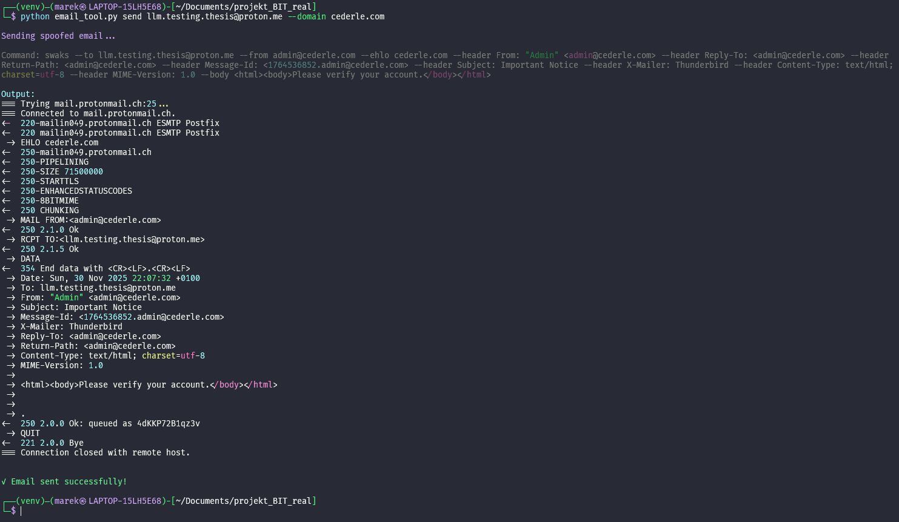

Môžeme vidieť že služba proton dovolila odoslanie emailu, ale označila ho ako neautentifikovaný a zobrazila varovanie.

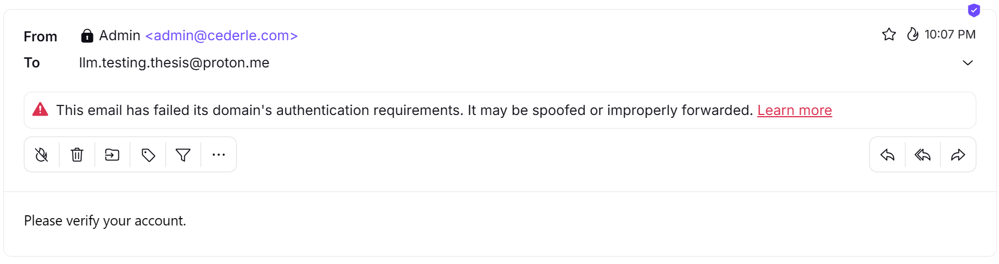

Je to z dôvôdu toho, že doména `cederle.com` má správne nastavené SPF/DKIM/DMARC záznamy, takže proton vie, že email neprešiel DMARC politikou a preto ho označil ako neautentifikovaný

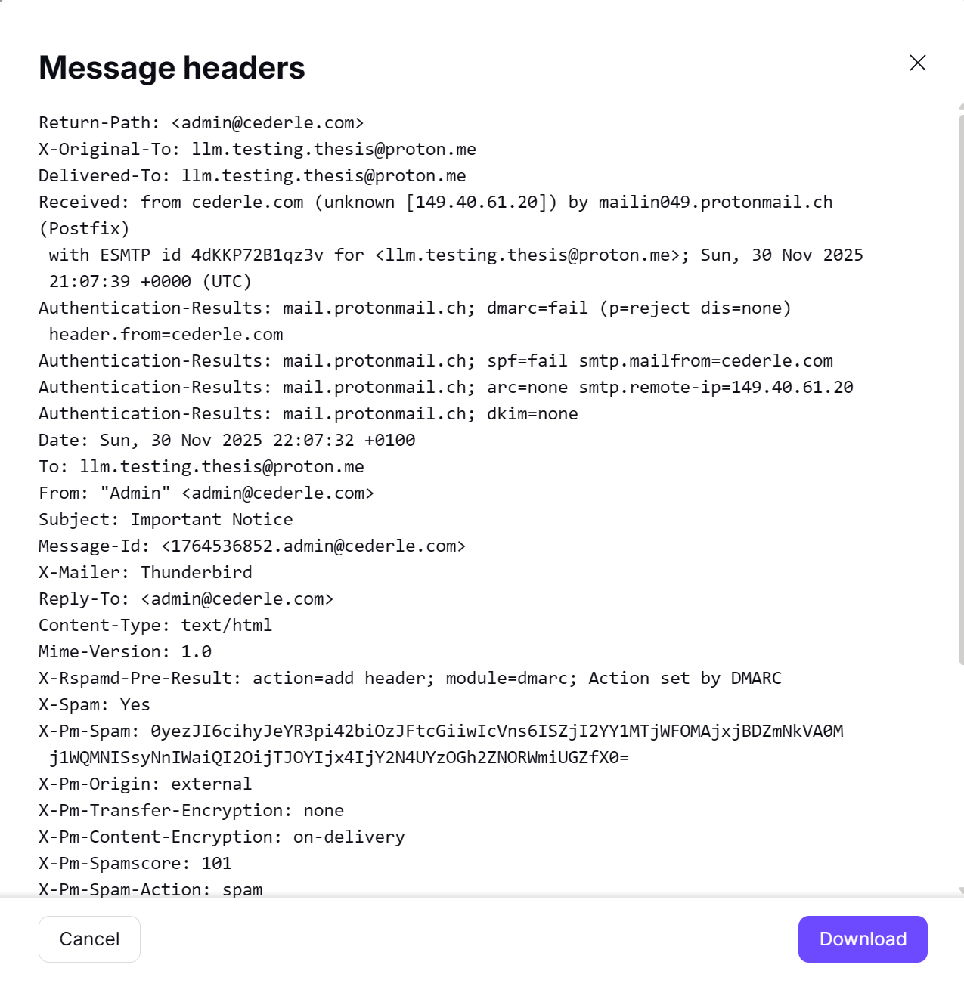

Testovanie celeho workflow v interaktívnom režime pre doménu `seniorom.sk`, ktorá bola vybraná nástrojom z dôvodu chýbajúcich SPF/DKIM/DMARC záznamov:

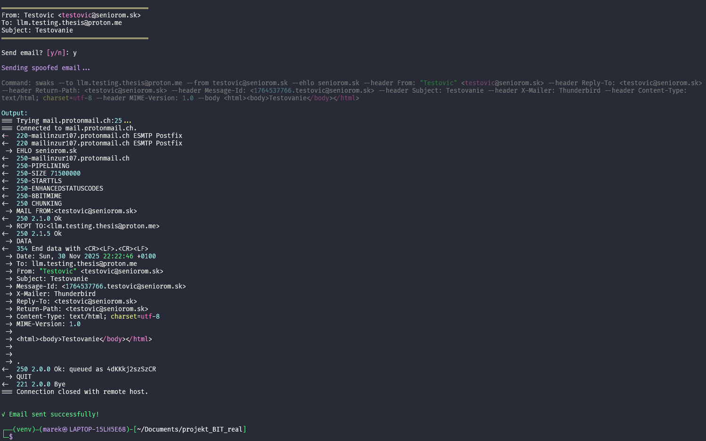

Teraz vidíme, že služba Proton "nemá problém" s daným emailom (email je stále v spame):

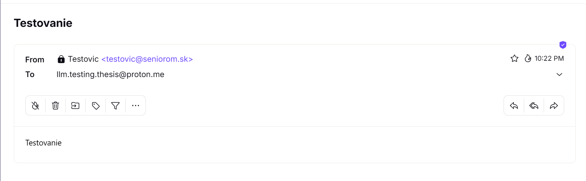

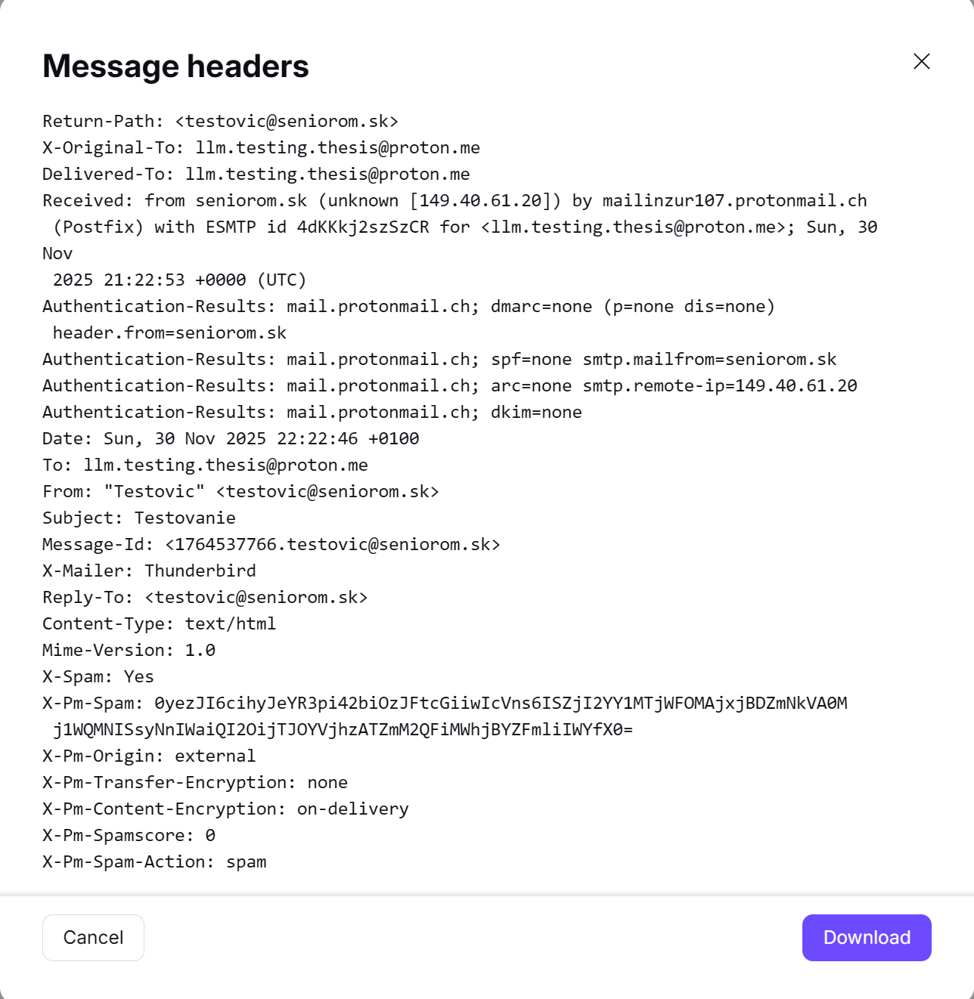

Testovanie pre doménu `seniorom.sk` a cieľovú adresu `marek@cederle.com`:

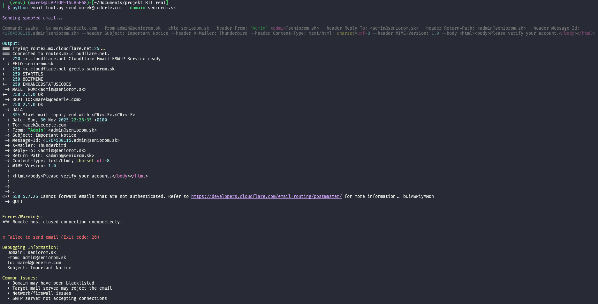

Môžeme vidieť, že Cloudflare zablokoval odoslanie emailu, kvôli tomu, že nebol autentifikovaný:

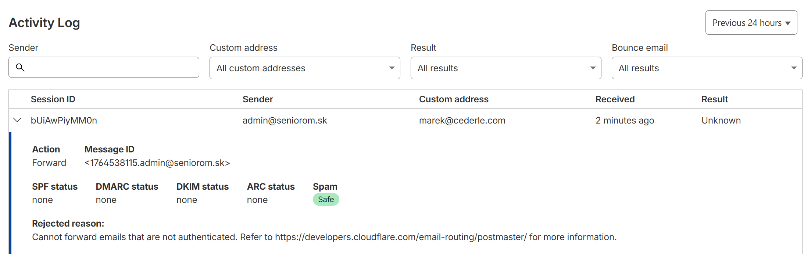

Ak vykúšame to isté len použijeme ako spoofovanú doménu `cederle.com`, ktorá má správne nastavené SPF/DKIM/DMARC záznamy, tak email neprejde, ale už kvôli SPF záznamu, ktorý hovorí že iba určité IP adresy môžu posielať emaily za túto doménu a kvôli DMARC:

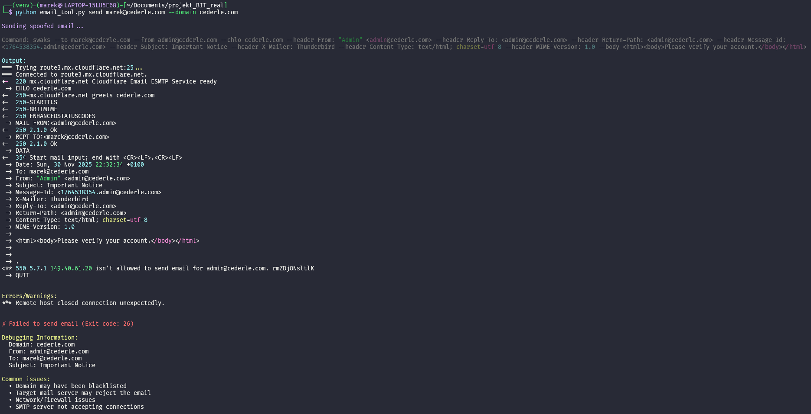

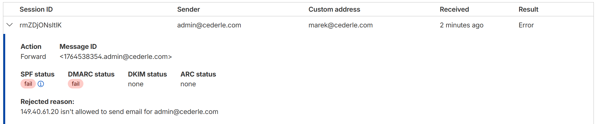

Ak vyskúšame poslať email na stuba.sk, tak email neprejde kvôli z dôvodu, že stuba má nastavené overovanie cez reverse DNS lookup. Tento mechanizmus sa snaží overiť našu verejnú IP adresu, ktorá nesedí s IP adresou spoofovanej domény pretože ju nevlastníme a nemáme taký záznam nastavený (nezáleží na tom či použijeme doménu seniorom.sk alebo cederle.com):

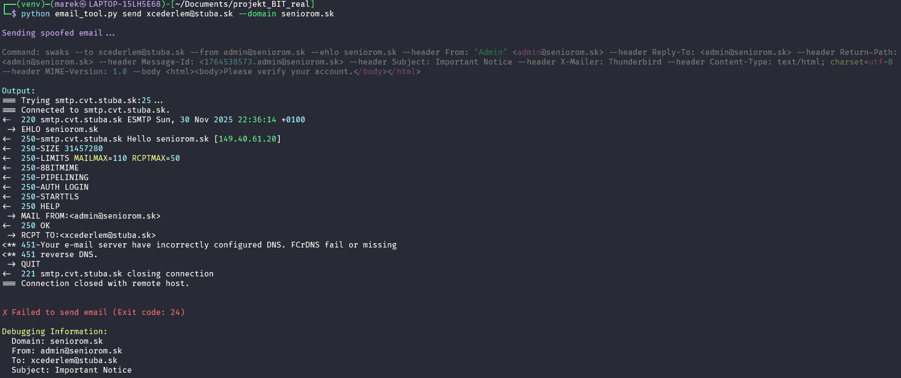

Na záver sme vyskúšali poslať email na gmail.com, ktorý taktiež zablokoval email kvôli nefunkčnosti reverse DNS lookupu:

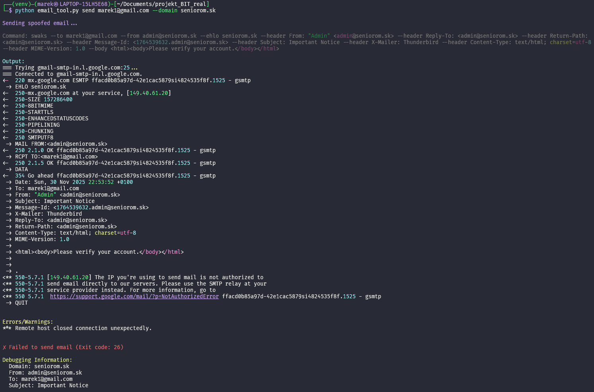

Pri použití domény `cederle.com` sa taktiež neposlal email, ale kvôli DMARC:

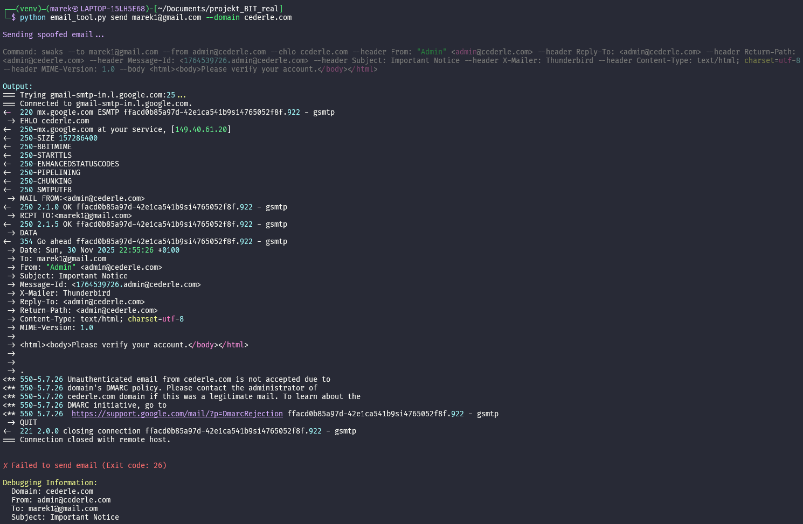

### Záver

Podarilo sa mi vytvoriť nástroj, ktorý dokáže nájsť spoofovateľnú doménu a následne odoslať spoofovaný email na zadanú cieľovú adresu. Nástroj som testoval na rôznych doménach a službách, pričom som zistil, že väčšina služieb má implementované ochranné mechanizmy, ktoré zabraňujú doručeniu spoofovaných emailov. Jedine služba Proton mi dovolila odoslať spoofovaný email, ale aj tak ho označila ako spam. 

Preto je dôležité, aby domény mali správne nastavené SPF/DKIM/DMARC záznamy, aby sa zabránilo zneužitiu.

#### Rozšíriteľnosť

Program by sa dal rozšíriť o pôvodnú myšlienku na analýzu hlavičiek e-mailov. Program by taktiež mohol byť rozšírený o možnosť automatického generovania phishingových stránok pomocou PyPhisher nástroja. Taktiež by mohlo byť pridaných viacero možností, aby toho nebolo veľa "hardcoded" a zároveň by mohlo byť lepšie urobené overovanie SPF/DKIM/DMARC záznamov zo skriptu z `dmarc` repozitára aby bral do úvahy zle nastavené záznamy.

### Referencie

- Nástroje
  - [ChatGPT](https://chatgpt.com/)
  - [Claude AI](https://claude.ai/)
  - [Domain analyzer](https://tools.sendmarc.com/domain-analysis/)
  - [checkdmarc](https://domaincheckup.net/)
- Články
  - [Email Spoofing](https://www.cloudflare.com/learning/email-security/what-is-email-spoofing/) / [WIKI](https://en.wikipedia.org/wiki/Email_spoofing)
  - [TXT DNS Record](https://www.cloudflare.com/learning/dns/dns-records/dns-txt-record/)
  - [DKIM](https://www.cloudflare.com/learning/dns/dns-records/dns-dkim-record/) / [WIKI](https://en.wikipedia.org/wiki/DomainKeys_Identified_Mail)
  - [DMARC](https://www.cloudflare.com/learning/dns/dns-records/dns-dmarc-record/) / [WIKI](https://en.wikipedia.org/wiki/DMARC)
  - [SPF](https://www.cloudflare.com/learning/dns/dns-records/dns-spf-record/) / [WIKI](https://en.wikipedia.org/wiki/Sender_Policy_Framework)
- Github repozitáre
  - [Swaks](https://github.com/jetmore/swaks)
  - [Dmarc fetching tool](https://github.com/sirpsycho/dmarc)
  - [GhostMail Collector - (List of vulnerable domains)](https://github.com/michaelshapkin/ghostmail-collector)
  - [PyPhisher](https://gitlab.com/KasRoudra/PyPhisher)
- Články poskytovateľov e-mailových služieb (prečo/ako blokujú spoofed e-maily)
  - [Google](https://support.google.com/a/answer/81126?visit_id=639000387538645772-1323224397&p=sender-guidelines-ip&rd=1#ip)
  - [stuba](https://en.wikipedia.org/wiki/Reverse_DNS_lookup)
  - [Cloudflare](https://developers.cloudflare.com/email-routing/postmaster/#mail-authentication-requirement)
  - [Proton](https://proton.me/support/email-has-failed-its-domains-authentication-requirements-warning) - neblokujú odoslanie ale označia ich že 
